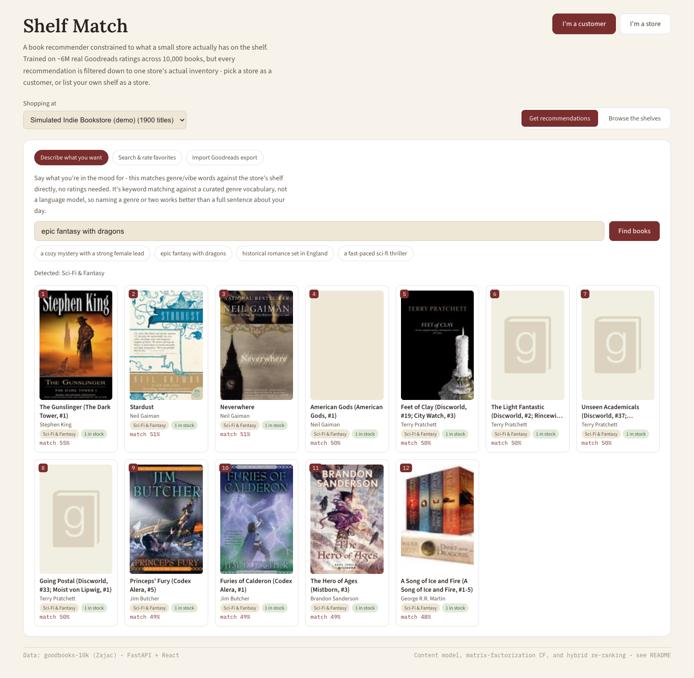

# Shelf Match

A book recommender constrained to what a small store actually has on the
shelf, not the whole internet's catalog. Trained on real Goodreads rating
data, but every recommendation is filtered down to one store's actual
inventory - so the interesting engineering problem isn't "recommend the
best book," it's "recommend the best book we can actually hand the
customer today."

Two sides to the app:
- **As a customer**, describe what you're in the mood for, search and
  rate a few favorites, or import a real Goodreads export - then compare
  content-based, collaborative, and hybrid recommendations, all scored
  against one store's shelf.
- **As a store**, upload the books you carry (a plain text list or a CSV)
  and get a store code - customers can then shop against exactly your
  inventory instead of the built-in simulated one.

- `backend/` - Python. `recsys/` holds the content-based model, the
  collaborative-filtering model, the hybrid ranker, the free-text query
  parser, and the store-matching/registry logic; `api/` is a FastAPI layer
  over all of it.
- `frontend/` - React + Vite. A customer/store role toggle, a store
  picker, three ways to build a customer profile, and a three-way
  recommendation comparison.

## Why this dataset, not a live Goodreads pull

Goodreads shut down its public API in 2020, and scraping goodreads.com
directly would violate its Terms of Service - a bad foundation for a
portfolio piece. Instead this uses
[goodbooks-10k](https://github.com/zygmuntz/goodbooks-10k) (Zajac): 10,000
books and about 6 million ratings from ~53,000 real Goodreads users,
already collected and hosted as plain CSVs. `fetch_data.py` downloads it
directly - no Kaggle account/API key needed.

A real user's history still gets to participate: `Import Goodreads export`
in the app accepts an actual `goodreads_library_export.csv` (Settings ->
Export Library on goodreads.com) and matches its rows against the catalog
by ISBN13, ISBN, then normalized title+author.

## Running it

```bash
# Terminal 1 - backend
cd backend
python3 -m venv venv && source venv/bin/activate
pip install -r requirements.txt
python fetch_data.py        # downloads goodbooks-10k (~100MB)
python build_inventory.py   # builds the simulated store inventory
python train_models.py      # fits the content + collaborative models (~2 min)
uvicorn api.main:app --reload --port 8020

# Terminal 2 - frontend
cd frontend
npm install
npm run dev   # http://localhost:5173
```

## Screenshots


**Customer: describe what you want.** No book titles needed - a store
picker at the top (defaults to the built-in simulated inventory), three
ways to build a profile, and example prompts for the free-text genre
search.


**Free-text genre matching.** "Epic fantasy with dragons" resolves to the
Sci-Fi & Fantasy section and returns Stephen King, Neil Gaiman, Terry
Pratchett, Brandon Sanderson - all keyword-matched against the same genre
vocabulary the content model itself uses, no language model involved.


**Content-based vs. collaborative vs. hybrid.** Rating Harry Potter and *A
Game of Thrones* five stars: content-based stays tightly on-genre,
collaborative filtering (honestly) leans on broadly-loved books given so
little signal to fold in, and the hybrid blends both - all three ranked
against the same 1,900-title inventory, side by side.


**Store: list your inventory.** A plain-text book list matched 9 of 10
rows against the catalog; the store gets a shareable code customers can
select from the store picker.


**A customer shopping a store-uploaded inventory.** Selecting that
9-book store from the picker scopes browsing, search, and recommendations
to exactly those titles - the same ranking logic, an arbitrarily small
inventory.

## The constrained-ranking problem

A generic recommender ranks the whole catalog and hopes the top pick is
purchasable somewhere. That's not what a bookstore's website needs - it
needs to rank *only what's on the shelf*. This project treats that as the
actual problem statement, not an afterthought:

- `build_inventory.py` builds a simulated ~1,900-book inventory (about 19%
  of the full catalog) by grouping books into sections (genre tags rolled
  up via `recsys/genre_tags.py`), giving each section a shelf-space quota
  proportional to its share of the full catalog, and sampling within a
  section weighted by `sqrt(ratings_count)` - popular books are more
  likely to be carried, but it's not simply "stock the top N." Even among
  the 50 most-rated books on Goodreads, **22% aren't in this store's
  inventory** (including *To Kill a Mockingbird* and *The Catcher in the
  Rye* in the sampled run) - realistic misses a recommender has to route
  around, not an edge case.
- `recsys/hybrid.py` scores *only* inventory books for content, collaborative,
  and hybrid ranking alike. There's no "rank everything, then filter to
  in-stock" pass - that approach can silently return fewer than N results
  whenever the ideal picks aren't stocked. Scoring the constrained set
  directly means the recommender is always solving the actual problem: best
  available, not best hypothetical.

## Any store, not just the built-in one

`recsys/stores.py` is a small in-memory registry: a "store" is just a
name plus a set of book_ids (and per-book stock counts). The pre-built
simulated inventory from `build_inventory.py` is registered as `"default"`
at API startup; a store owner uploading a book list through the app (`POST
/api/stores`) gets a fresh one, matched against the catalog the same way a
Goodreads export is (`recsys/store_import.py`, sharing the ISBN13 -> ISBN
-> title+author -> title-alone matcher in `recsys/matching.py` with the
Goodreads importer rather than duplicating that logic). Every
recommendation/browse/search endpoint takes a `store_id` and scores or
filters against *that* store's set - a customer picking a 9-book store a
store owner just uploaded gets ranked results over exactly those 9 books,
not the 1,900-book default.

This is intentionally ephemeral and unauthenticated (no database, no
accounts, stores vanish on server restart) - the right scope for
demonstrating the constrained-ranking logic generalizes to *any* inventory
size, not a claim that this is production multi-tenancy.

## Describing what you want, without an LLM

The customer's other cold-start path - "type in the kind of book you're
looking for" - doesn't call out to a language model. `recsys/query_parser.py`
whole-word-matches the query against the same ~300 raw Goodreads tag
phrases `genre_tags.py` already collapses into ~40 canonical genres (so
"sci-fi," "scifi," and "space opera"-adjacent tags all resolve the same
way as they do for the content model), builds a synthetic token document
in the *exact* vector space `ContentModel`'s TF-IDF vectorizer was fit on,
and reuses that model's own scoring - no separate index, no new
dependency. Longer phrases are matched first and claim their span so a
generic word inside a more specific phrase isn't double-counted (`"novel"`
-> literary-fiction shouldn't also fire inside `"graphic novel"` ->
graphic-novels).

This is keyword matching, not language understanding, and the API/UI say
so directly: a query with no recognizable genre word ("something my
grandmother would like") returns no results and an explicit message
rather than a guess dressed up as a real answer.

## Two models, compared, plus a hybrid

**Content-based** (`recsys/content_model.py`): TF-IDF over each book's
genre-tag profile (aggregated from Goodreads' folksonomy tags - see
`genre_tags.py` for how ~300 raw shelf tags like `ya-fantasy`,
`sci-fi-fantasy`, `mystery-suspense` collapse into ~40 canonical genres)
plus its author, cosine similarity for ranking. Needs no ratings history
at all - just the book's own metadata - so it's what keeps the system
useful for a genuinely cold visitor.

**Collaborative filtering** (`recsys/collaborative_model.py`): a
latent-factor model (`rating ≈ global_mean + user_bias + item_bias + U·V`,
40 factors) trained with full-batch gradient descent on the ~6M observed
ratings only - not TruncatedSVD on the raw sparse matrix, which would
treat every unrated (user, book) pair as a rating of zero and bias the
whole model toward predicting low ratings everywhere. Final validation
RMSE: **0.857** (on the 1-5 scale, ~5% held out).

Since a real visitor isn't one of the 53k training users, `fold_in_user`
solves a small ridge-regression problem - given a few stated (book,
rating) pairs, find the latent vector that best explains them against the
already-trained item factors. This "folding-in" is standard for
latent-factor models and is what makes the collaborative model usable for
a new user's stated favorites at all.

**Collaborative filtering's honest limit, in this app specifically:** even
after fixing the bias-shrinkage bug below, folding in a handful of stated
ratings (tested with both 6 and 12) isn't enough signal to meaningfully
beat a "solve for 40 latent dimensions from a dozen data points"
regression - the raw collaborative-only column tends to surface broadly
beloved books (Calvin & Hobbes compilations genuinely average 4.8+ on
Goodreads) rather than anything specific to a stated Harry Potter/A Song
of Ice and Fire profile. This is a well-known, real characteristic of
latent-factor cold start, not a leftover bug - it's exactly why the hybrid
column exists: blending in the content model, which needs no ratings
history at all, is what keeps the top recommendations genre-relevant when
collaborative filtering alone can't yet say much about a brand-new user.

**Hybrid** (`recsys/hybrid.py`): min-max normalizes both scores and blends
them with a user-adjustable weight (the frontend's slider).

## Two real bugs this surfaced (and what fixed them)

Both were caught the same way as everything else in this project's family:
by checking whether a *specific, known* case (a Harry Potter fan's
recommendations) produced a sane answer, not just whether the code ran.

1. **Bias terms weren't actually shrinking by sample size.** The first
   training loop regularized item bias with `bi += lr*(grad/count -
   reg*bi)`. Its fixed point is `bi = (grad/count)/reg` - shrinkage that's
   *independent of how many ratings support that estimate*. A niche book
   rated by 80 enthusiasts got exactly as little regularization as one
   rated by 30,000 people, so a handful of five-star outliers could push
   an obscure title's bias above every well-known book's. Once personalization
   is weak (a new user with only a few stated ratings), those inflated
   biases dominated the ranking outright - recommending Calvin & Hobbes
   compilations and a random poetry collection to a stated Harry Potter
   fan. Fixed with the standard ridge/ALS closed form instead,
   `bi = sum_residuals / (count + bias_reg)`, which shrinks low-count
   items toward 0 and barely touches well-supported ones.
2. **`np.add.at` is not a fast way to scatter-accumulate 6M gradients.**
   The obvious numpy translation of "sum each rating's gradient into its
   user's/item's row" is `np.add.at(grad, idx, values)`. It's correct and
   ~15x slower than expressing the same accumulation as a sparse-matrix
   multiply (a precomputed sparse "which user does rating r belong to"
   selector times the dense per-rating contribution) - roughly 35s/epoch
   vs. ~2.5s/epoch on this dataset, because `add.at` forgoes the
   vectorization a real BLAS matmul gets.

## API

| Endpoint | What it does |
|---|---|
| `GET /api/stores` | List every registered store: `{id, name, size}` |
| `POST /api/stores` | Multipart `name` + book-list file (CSV or plain text) - matches it against the catalog, registers a new store, returns a `store_id` |
| `GET /api/stores/{id}/sections` | Section names + counts for that store |
| `GET /api/stores/{id}/inventory?section=&offset=&limit=` | Browse that store's inventory, optionally filtered by section |
| `GET /api/books/search?q=&store_id=` | Search the full 10k-book catalog by title/author (not just inventory - you can name a favorite a given store doesn't carry); annotates whether each hit is in that store |
| `POST /api/recommendations` | Body: `{"liked": [{"book_id","rating"}, ...], "store_id": "default", "alpha": 0.5, "top_n": 12}` - content/collaborative/hybrid rankings, scored against that store only |
| `POST /api/recommendations/by-description` | Body: `{"query": "...", "store_id": "default", "top_n": 12}` - free-text genre matching, content-only (no ratings to fold into collaborative filtering) |
| `POST /api/goodreads-import` | Multipart CSV + `store_id` - matches a real Goodreads export against the catalog, annotated for that store |

## What's real vs. simulated

The ratings, books, and genre tags are real Goodreads data. The
**inventory is not a real store's** - getting one would mean scraping a
specific shop's website, which is fragile, likely against that site's
terms, and out of scope for a portfolio piece. It's constructed
transparently (see `build_inventory.py`) to have a plausible, genre-diverse
mix with real misses, rather than invented to make the recommender look
good.
