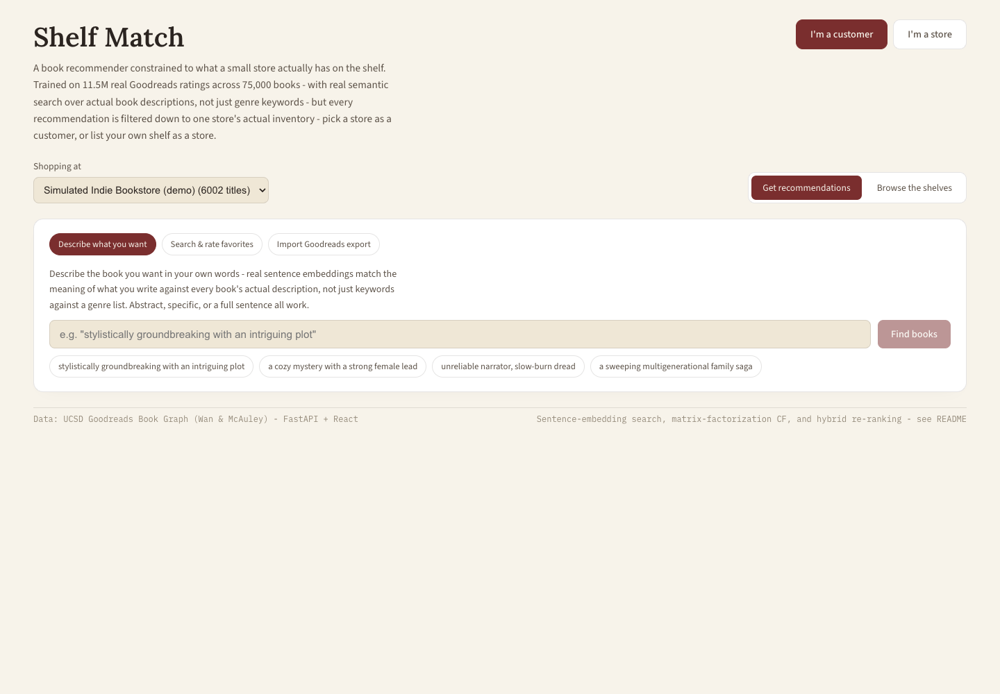
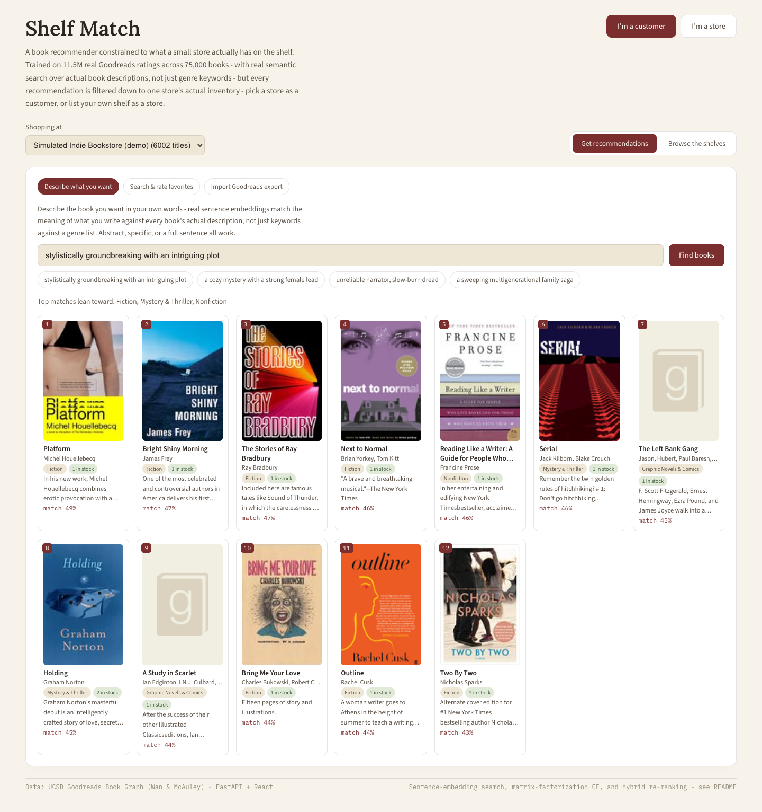
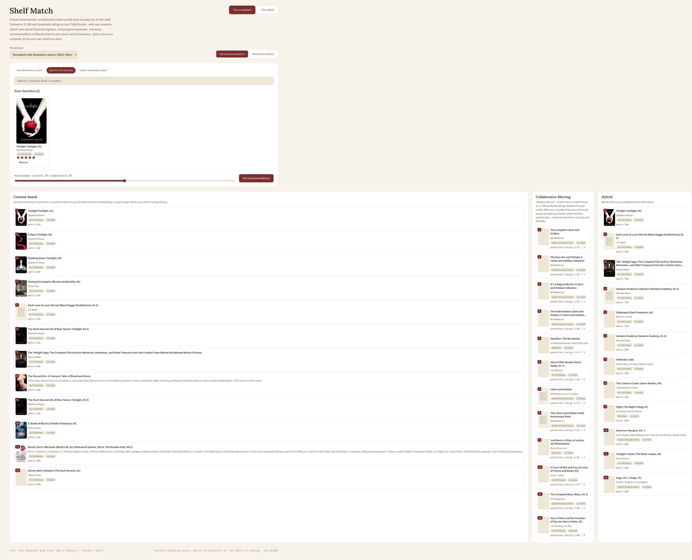
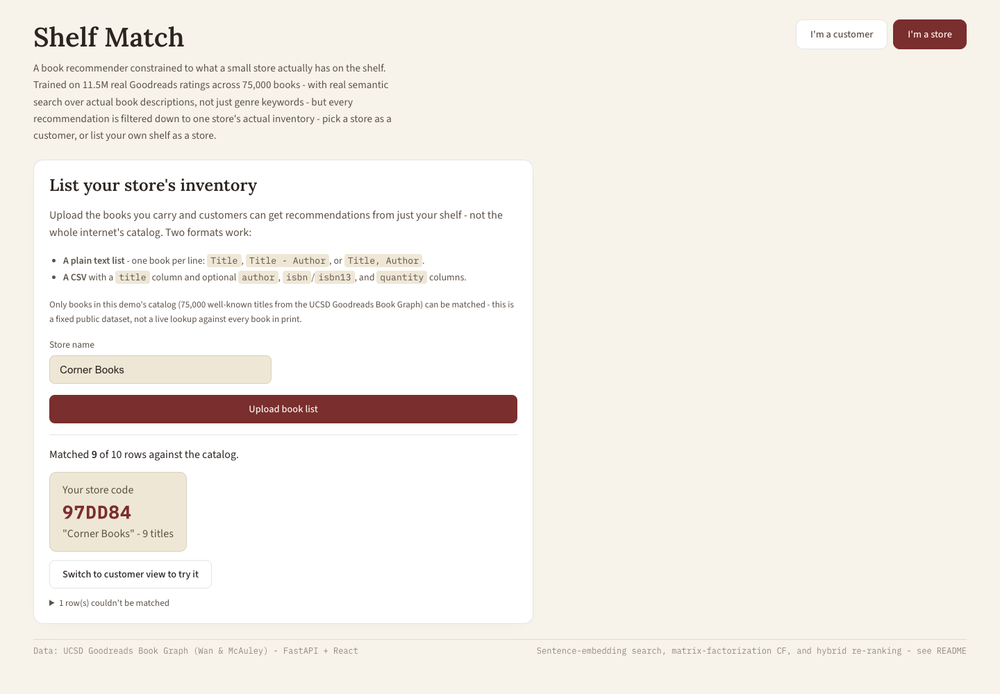
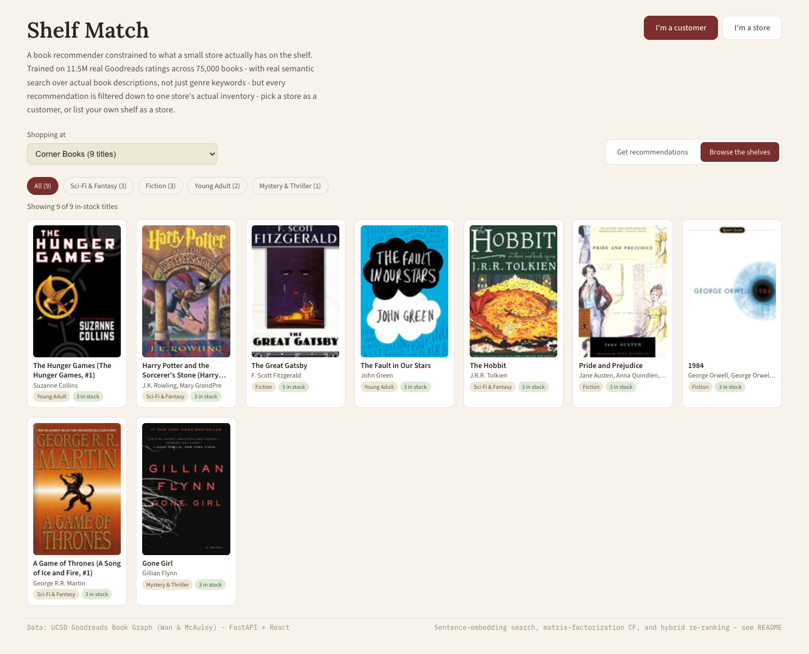

# Shelf Match

A book recommender constrained to what a small store actually has on the
shelf, not the whole internet's catalog. Trained on real Goodreads data at
a genuinely large scale, but every recommendation is filtered down to one
store's actual inventory - so the interesting engineering problem isn't
"recommend the best book," it's "recommend the best book we can actually
hand the customer today."

Two sides to the app:
- **As a customer**, describe what you're in the mood for in your own
  words - real sentence embeddings, not keyword matching - search and
  rate a few favorites, or import a real Goodreads export, then compare
  content-based, collaborative, and hybrid recommendations, all scored
  against one store's shelf.
- **As a store**, upload the books you carry (a plain text list or a CSV)
  and get a store code - customers can then shop against exactly your
  inventory instead of the built-in simulated one.

- `backend/` - Python. `recsys/` holds the semantic search model, the
  collaborative-filtering model, the hybrid ranker, and the
  store-matching/registry logic; `api/` is a FastAPI layer over all of it.
- `frontend/` - React + Vite. A customer/store role toggle, a store
  picker, three ways to build a customer profile, and a three-way
  recommendation comparison.

## The dataset: 75,000 books, 11.5M ratings, real descriptions

This project started on [goodbooks-10k](https://github.com/zygmuntz/goodbooks-10k)
(10,000 books, ~6M ratings) - a great, easy dataset to get started with,
but with a hard ceiling: it has no book *description* text at all, only
Goodreads' user-generated shelf tags. That's fine for "what genre is this,"
useless for "what does this book actually say about itself" - which turns
out to be exactly what real natural-language search needs (see below).

It now runs on the **[UCSD Goodreads Book Graph](https://cseweb.ucsd.edu/~jmcauley/datasets/goodreads.html)**
(Wan & McAuley, RecSys'18): 2.36M books with real descriptions, authors,
and clean genre labels, plus interaction data separate from goodbooks-10k
entirely. `fetch_large_dataset.py` downloads it directly - no Kaggle
account needed - with two real size constraints handled explicitly rather
than glossed over:

- **`goodreads_books.json.gz` is ~2GB compressed** (2.36M books) - not
  something to hold in memory as Python objects. `build_large_catalog.py`
  streams it as newline-delimited JSON straight out of gzip and keeps only
  a bounded **streaming top-K** (a min-heap of size 75,000, keyed by
  `ratings_count`) of English-language books with a real description, so
  peak memory is O(75,000), never O(2.36M). Scans all 2.36M records in
  under 6 minutes on a laptop.
- **`goodreads_interactions.csv` is ~4.3GB** (hundreds of millions of
  rows) - downloading it in full wasn't practical here, so
  `fetch_large_dataset.py` pulls only the first ~600MB via an HTTP Range
  request. The file is sorted by `user_id`, so this is every interaction
  from the first ~67K real users, not a uniform random sample across all
  ~876K users in the full dataset - a real, disclosed trade-off, not a
  sample dressed up with a randomness property it doesn't have. It's
  still **11.5M explicit ratings** - nearly double goodbooks-10k's full
  6M, from a genuinely partial slice of a much bigger dataset.

A real user's history still gets to participate: `Import Goodreads export`
in the app accepts an actual `goodreads_library_export.csv` (Settings ->
Export Library on goodreads.com) and matches its rows against the catalog
by ISBN13, ISBN, then normalized title+author.

## Running it

```bash
# Terminal 1 - backend
cd backend
python3 -m venv venv && source venv/bin/activate
pip install -r requirements.txt

python fetch_large_dataset.py       # downloads the UCSD Goodreads Book Graph (~2.7GB)
python build_large_catalog.py       # streams 2.36M books -> top 75,000 by ratings_count (~6 min)
python build_inventory.py           # builds the simulated store inventory
python build_large_interactions.py  # filters interactions -> ratings_large.csv
python train_large_models.py        # fits the semantic + collaborative models (~15 min on a quiet machine, longer under memory pressure - see below)

uvicorn api.main:app --reload --port 8020

# Terminal 2 - frontend
cd frontend
npm install
npm run dev   # http://localhost:5173
```

## Screenshots


**Customer: describe what you want.** A store picker at the top (defaults
to the built-in simulated inventory), three ways to build a profile, and
example prompts - including genuinely abstract ones a keyword search
could never handle.


**Real semantic search, not keyword matching.** "Stylistically
groundbreaking with an intriguing plot" has no genre tag - it's a
judgment about prose style that only exists in the text of an actual
description. Sentence embeddings place semantically similar descriptions
close together regardless of shared vocabulary; see the worked example
below.


**Content-based vs. collaborative vs. hybrid.** Content-based stays
tightly on-theme, collaborative filtering (honestly) leans on broadly-loved
books given so little signal to fold in, and the hybrid blends both - all
three ranked against the same store, side by side.


**Store: list your inventory.** A plain-text book list matched against
the catalog; the store gets a shareable code customers can select from
the store picker.


**A customer shopping a store-uploaded inventory.** Selecting that store
from the picker scopes browsing, search, and recommendations to exactly
those titles - the same ranking logic, an arbitrarily small inventory.

## The constrained-ranking problem

A generic recommender ranks the whole catalog and hopes the top pick is
purchasable somewhere. That's not what a bookstore's website needs - it
needs to rank *only what's on the shelf*. This project treats that as the
actual problem statement, not an afterthought:

- `build_inventory.py` builds a simulated ~6,000-book inventory (8% of
  the 75,000-book catalog) by giving each genre section a shelf-space
  quota proportional to its share of the full catalog, then sampling
  within a section weighted by `sqrt(ratings_count)` - popular books are
  more likely to be carried, but it's not simply "stock the top N." The
  vast majority of the catalog, including plenty of well-known books,
  simply isn't selected - a realistic miss a recommender has to route
  around, not an edge case.
- `recsys/hybrid.py` scores *only* inventory books for content,
  collaborative, and hybrid ranking alike. There's no "rank everything,
  then filter to in-stock" pass - that approach can silently return fewer
  than N results whenever the ideal picks aren't stocked. Scoring the
  constrained set directly means the recommender is always solving the
  actual problem: best available, not best hypothetical.

## Any store, not just the built-in one

`recsys/stores.py` is a small in-memory registry: a "store" is just a
name plus a set of book_ids (and per-book stock counts). The pre-built
simulated inventory from `build_inventory.py` is registered as `"default"`
at API startup; a store owner uploading a book list through the app (`POST
/api/stores`) gets a fresh one, matched against the catalog the same way a
Goodreads export is (`recsys/store_import.py`, sharing the ISBN13 -> ISBN
-> title+author -> title-alone matcher in `recsys/matching.py` with the
Goodreads importer rather than duplicating that logic). Every
recommendation/browse/search endpoint takes a `store_id` and scores or
filters against *that* store's set - a customer picking a small store a
store owner just uploaded gets ranked results over exactly those books,
not the 6,000-book default.

This is intentionally ephemeral and unauthenticated (no database, no
accounts, stores vanish on server restart) - the right scope for
demonstrating the constrained-ranking logic generalizes to *any* inventory
size, not a claim that this is production multi-tenancy.

## Real semantic search, and why that required a bigger dataset

The whole reason for the dataset migration above: goodbooks-10k has no
description text, so the first version of "describe what you want" could
only whole-word-match a query against ~300 known Goodreads shelf-tag
phrases collapsed into ~40 canonical genres. That's a real, useful
feature - but it's fundamentally a lookup table. A query like *"stylistically
groundbreaking with an intriguing plot"* isn't a genre at all - it's a
judgment about prose style and narrative craft, and no amount of tag
matching will ever recognize it, by construction.

`recsys/semantic_model.py` instead embeds every book's title + description
+ genre into a 384-dimensional vector via `sentence-transformers/all-MiniLM-L6-v2`,
and embeds a customer's query into the *same* space, ranking by cosine
similarity. This is a meaning-based comparison, not a word-overlap one -
two descriptions that both talk about "an unconventional narrative
structure" and "defying genre expectations" land close together even if
they share almost no vocabulary with the query itself. A quick sanity
check run during development, encoding five real book-style descriptions
and comparing each to that exact query:

| Description (paraphrased) | Cosine similarity |
|---|---|
| *Ulysses* - modernist, shifting styles chapter to chapter, one of the most formally innovative novels ever written | **0.475** |
| *House of Leaves* - unconventional format, footnotes, dizzying narrative structure | **0.359** |
| A formulaic, predictable small-town romance | 0.266 |
| *Gone Girl* - twisty thriller, unreliable narrators | 0.185 |
| A weeknight-dinner cookbook | 0.152 |

The model ranks the two formally experimental novels highest and the
cookbook lowest, with no genre tag or keyword shared between the query and
either top result - real semantic understanding, not a lookup table with
extra steps.

This did have a real cost worth being honest about: encoding all 75,000
book descriptions through an actual transformer model - vs. a couple of
seconds to build the old TF-IDF-over-genre-tags matrix - took roughly
10-15 minutes of actual CPU work on a quiet machine (description text
runs to full paragraphs, not a handful of tag tokens, and there's no
shortcut around running every one through the model at least once). On a
memory-constrained machine it's worse than that in practice: the run this
project's README numbers come from took **~2 hours** wall-clock because
the OS was swapping heavily under memory pressure - `SentenceTransformer.encode()`
holds the whole batch's activations in memory, and once physical RAM is
exhausted every batch pays a round trip to swap instead of running at CPU
speed. `all-MiniLM-L6-v2` was picked specifically for CPU-friendly
throughput over a larger, marginally more accurate model; if memory is
tight, reducing `MAX_BOOKS` in `build_large_catalog.py` (e.g. to 30,000)
is the more direct lever than the model choice.

`SemanticModel` implements the same `profile_vector(liked_book_ids,
ratings)` / `score_all_items(vector)` interface the old TF-IDF
`ContentModel` did, so `recsys/hybrid.py` didn't need to change at all to
use it for the liked-books ranking path too - only the free-text
"describe what you want" endpoint is new.

## Two models, compared, plus a hybrid

**Content-based** (`recsys/semantic_model.py`): sentence embeddings, as
above. Needs no ratings history at all - just the book's own metadata -
so it's what keeps the system useful for a genuinely cold visitor, and
what powers free-text description search directly.

**Collaborative filtering** (`recsys/collaborative_model.py`): a
latent-factor model (`rating ≈ global_mean + user_bias + item_bias + U·V`,
40 factors) trained with full-batch gradient descent on the 11.5M observed
ratings only - not TruncatedSVD on the raw sparse matrix, which would
treat every unrated (user, book) pair as a rating of zero and bias the
whole model toward predicting low ratings everywhere. Validation RMSE:
**0.835** (on the 1-5 scale, ~5% held out) - actually a touch better than
goodbooks-10k's 0.857, despite 7.5x more items to place in the same
40-dimensional space, simply from having roughly double the ratings to
learn from.

Since a real visitor isn't one of the 67K training users, `fold_in_user`
solves a small ridge-regression problem - given a few stated (book,
rating) pairs, find the latent vector that best explains them against the
already-trained item factors. This "folding-in" is standard for
latent-factor models and is what makes the collaborative model usable for
a new user's stated favorites at all.

**Collaborative filtering's honest limit, in this app specifically:**
folding in a handful of stated ratings isn't enough signal to meaningfully
beat a "solve for 40 latent dimensions from a dozen data points"
regression - the raw collaborative-only column tends to surface broadly
beloved books rather than anything specific to a stated profile. This is
a well-known, real characteristic of latent-factor cold start, not a
leftover bug - it's exactly why the hybrid column exists: blending in the
semantic model, which needs no ratings history at all, is what keeps the
top recommendations relevant when collaborative filtering alone can't yet
say much about a brand-new user.

**Hybrid** (`recsys/hybrid.py`): min-max normalizes both scores and blends
them with a user-adjustable weight (the frontend's slider).

## Real bugs this surfaced (and what fixed them)

Every one of these was caught the same way: checking whether a *specific,
known* case produced a sane answer, not just whether the code ran.

1. **Bias terms weren't actually shrinking by sample size** (collaborative
   model). The first training loop regularized item bias with `bi +=
   lr*(grad/count - reg*bi)`. Its fixed point is `bi = (grad/count)/reg` -
   shrinkage that's *independent of how many ratings support that
   estimate*. A niche book rated by 80 enthusiasts got exactly as little
   regularization as one rated by 30,000 people, so a handful of
   five-star outliers could push an obscure title's bias above every
   well-known book's - and once personalization is weak, those inflated
   biases dominated the ranking outright. Fixed with the standard
   ridge/ALS closed form instead, `bi = sum_residuals / (count +
   bias_reg)`, which shrinks low-count items toward 0 and barely touches
   well-supported ones.
2. **`np.add.at` is not a fast way to scatter-accumulate millions of
   gradients.** The obvious numpy translation of "sum each rating's
   gradient into its user's/item's row" is `np.add.at(grad, idx, values)`.
   It's correct and ~15x slower than expressing the same accumulation as
   a sparse-matrix multiply (a precomputed sparse "which user does rating
   r belong to" selector times the dense per-rating contribution),
   because `add.at` forgoes the vectorization a real BLAS matmul gets.
3. **A float-specific ISBN cleaner silently broke on the new dataset's
   schema.** goodbooks-10k stores ISBN13 as a float column (`NaN` for
   missing), so the original matcher did `clean_isbn(str(int(x)))` to
   avoid `str(9780312853129.0)` turning into `"97803128531290"` - an
   extra trailing digit from the `.0` suffix corrupting every real ISBN.
   The UCSD dataset stores ISBN13 as a plain string column with `""` for
   missing instead - `int("")` raises `ValueError`, which would have
   crashed every store upload and Goodreads import on this dataset.
   `matching.py`'s `_isbn_column_value` now branches on the actual input
   type instead of assuming one schema; `test_matching.py` regression-tests
   both the old float-column schema and the new string-column one.

## API

| Endpoint | What it does |
|---|---|
| `GET /api/stores` | List every registered store: `{id, name, size}` |
| `POST /api/stores` | Multipart `name` + book-list file (CSV or plain text) - matches it against the catalog, registers a new store, returns a `store_id` |
| `GET /api/stores/{id}/sections` | Section names + counts for that store |
| `GET /api/stores/{id}/inventory?section=&offset=&limit=` | Browse that store's inventory, optionally filtered by section |
| `GET /api/books/search?q=&store_id=` | Search the full 75k-book catalog by title/author (not just inventory); annotates whether each hit is in that store |
| `POST /api/recommendations` | Body: `{"liked": [{"book_id","rating"}, ...], "store_id": "default", "alpha": 0.5, "top_n": 12}` - content/collaborative/hybrid rankings, scored against that store only |
| `POST /api/recommendations/by-description` | Body: `{"query": "...", "store_id": "default", "top_n": 12}` - real semantic search (sentence embeddings), content-only (no ratings to fold into collaborative filtering) |
| `POST /api/goodreads-import` | Multipart CSV + `store_id` - matches a real Goodreads export against the catalog, annotated for that store |

## What's real vs. simulated

The books, descriptions, genres, and ratings are real Goodreads data (the
interactions are a genuine partial slice of the full dataset, not
synthesized). The **inventory is not a real store's** - getting one would
mean scraping a specific shop's website, which is fragile, likely against
that site's terms, and out of scope for a portfolio piece. It's
constructed transparently (see `build_inventory.py`) to have a plausible,
genre-diverse mix with real misses, rather than invented to make the
recommender look good.
